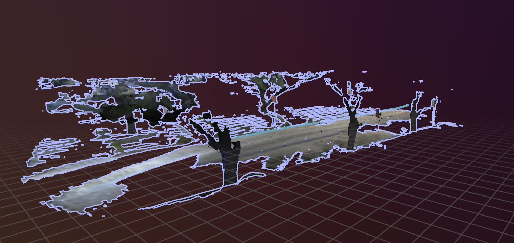
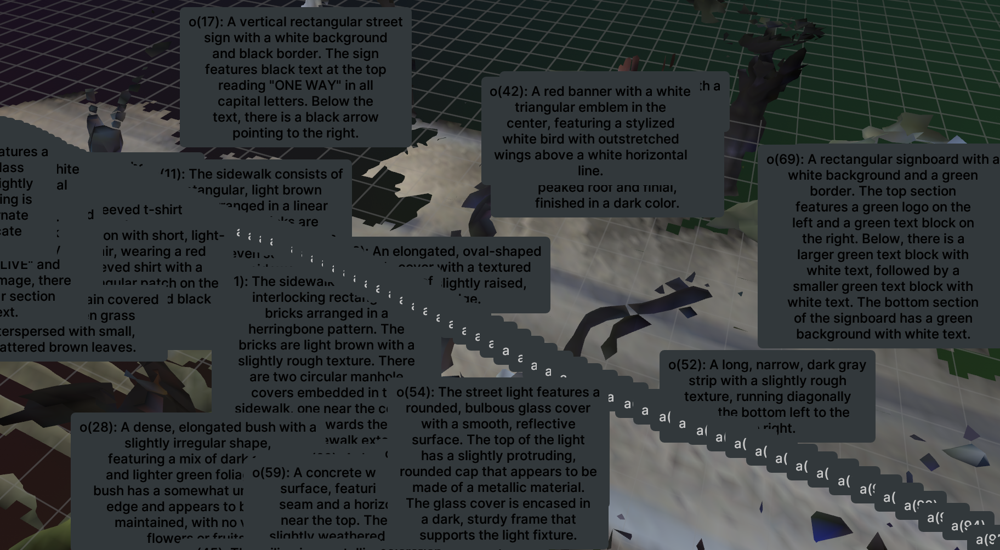

# Section 3 — Understanding the Models and Modules

This section goes through every model and algorithm in the DAAAM pipeline: what it
does, how it's built, and how we know what we know about it. For each neural network
there's a diagram of its internals. For each non-learned module (things that are just
code and math, no training involved) there's a diagram of its logic instead. Anything
we're not 100% sure about is labeled as an assumption rather than stated as fact.

---

## 1. What each stage does

| Stage | Model/algorithm | Checkpoint | Config | Purpose | Input | Output | Where it runs in code | Device | Timing |
|---|---|---|---|---|---|---|---|---|---|
| 1. Depth estimation | FoundationStereo (nicogorlo fork) | `23-51-11` / `model_best_bp2.pth` — this is NVIDIA's own official checkpoint name, confirmed | stereo pair cam0/cam1, `depth_lb=0.05`, `depth_ub=20.0` | Turn a stereo pair into a depth map | Left+right rectified RGB (640×480) | Per-pixel depth map (png) | `scripts/run_coda_depth_estimation.py` | GPU | 10m47s / 400 frames (done ahead of time, offline) |
| 2. Segmentation | FastSAM-x | `fastsam/FastSAM-x.pt` | `min_mask_region_area=400, max_mask_region_area=307200, polygon_epsilon_factor=0.001, imgsz=(480,640)` | Find every object-shaped blob in a frame, without knowing what it is | RGB frame, 640×480 | Masks + confidence scores | `daaam/segmentation/services.py` | GPU | ~25–60ms per frame (whole-pipeline number) |
| 3. Tracking | BotSort (boxmot v11.0.8) | none — ReID turned off (`with_reid=False`; no checkpoint ever found for `clip_general.engine` or `osnet_x0_25_msmt17.pt`) | `track_buffer=30, device=cuda, enable_temporal_history=True` | Follow the same object across frames, give it a persistent ID | Masks + boxes from stage 2 | Track IDs over time | `daaam/tracking/services.py` | GPU (just motion math, no ReID model loaded) | included in the timing above |
| 4. Assignment (not a model) | `min_frames_max_size` worker | none — pure optimization | `min_obs_per_track=8, N_masks_per_batch=64, min_frame_margin_slack=1, min_mask_region_area=400, max_mask_region_area=307200, position_score_weight=0.5, size_score_weight=0.5, query_interval_frames=120` | Pick the best few frames of each tracked object to actually describe | Tracks + candidate frames | Selected frames/masks | `daaam/assignment/workers/min_frames_max_size.py` | CPU (just solving math, no GPU needed) | runs roughly every 120 frames |
| 5. Description | DAM (`nvidia/DAM-3B`) | `nvidia/DAM-3B` (HuggingFace) | `dam_prompt_mode='focal_prompt', multi_image_min_n_masks=32, compute_full_image_description=True` | Write a detailed text description of one masked object | Selected image(s) + mask(s) | Free-text description | `daaam/query_manager/dam/services.py` | GPU | confirmed working — loaded cleanly, 11 images / 44 masks described in one batch |
| 6. Scene graph building | Hydra + Spark-DSG (Khronos-style setup) | `hydra` @ `2e58a35baea629eee8838409771876acff015daf`, `spark_dsg` @ `3c40997e4ae739c56ed3cdd6ef5e882d403d8b64` | `coda_dataset_khronos.yaml`: `voxel_size=0.2m, truncation_distance=0.6m, semantic label confidence=0.9`; object clustering `min_cluster_size=40, cluster_tolerance=0.25` | Turn RGB-D + poses into a 3D map with labeled objects, places and rooms | RGB-D, poses, tracks, semantic corrections | 4D scene graph: objects, places, rooms, relationships | `hydra_ros_node` (C++) | CPU, 32 threads | **known issue** (details in §3.2): the objects layer comes out empty every time, even though everything upstream works |
| 7. Sentence embeddings | not turned on this run | — | — | Turn text descriptions into vectors for search | Text | Embeddings | `daaam/query_manager/...` | N/A | Exercised separately as a standalone script on saved DAM captions: 46 descriptions, dim 384, PCA 2D explained variance 0.289 |
| 8. Chat agent | `gpt-4.1` (was `gpt-5-mini` in an older config) | hosted API, no local checkpoint | `agent_model_name: "gpt-4.1"` | Answer questions about the scene graph in natural language | A question + tools to query the graph | Text answer | `daaam/query_manager/mmllm/services.py` | N/A (API call) | not used yet, no question has been asked in any run |

Two settings in row 4 turned out to match the paper's own defaults exactly — the frame
slack (`ε`) and the position/size weighting (`α`). That's a strong sign this part of
the code follows the paper as published, not a modified version.

---

## 2. The neural network models

### 2.1 FoundationStereo — turns two camera views into a depth map

In plain terms: it takes the left and right camera images, pulls out features from
both (using both a regular CNN and a frozen general-purpose depth model called
DepthAnythingV2, so it doesn't have to relearn "what does depth roughly look like"
from scratch), builds a big volume comparing how well every pixel in one image matches
every pixel in the other, filters that volume down, and then refines its first guess
over several passes using a small recurrent network (GRU) before outputting a final
disparity map. That disparity map is then converted to an actual depth (in meters)
afterward — that conversion step happens outside the network itself, in our own code.

**What's trained vs. frozen:** only the DepthAnythingV2 part is frozen — everything
else is trained together. The paper's own tests show that freezing that specific part
works better than letting it retrain (freezing it keeps useful knowledge from its
original, much larger training).

**About the checkpoint:** the file names (`23-51-11`, `model_best_bp2.pth`) looked like
they might be a custom-trained version at first, but they're actually NVIDIA's own
official release name for their best-quality model. So this run uses the real,
published weights, not a private retrain.

**Why it fits here / limitations:** DAAAM needs depth that works on a brand-new scene
without retraining for that scene, which is exactly what this model is built for. Its
known weak spots (per the paper itself): it's not fast (roughly matches this run's
measured ~1.6s/frame, though not an exact apples-to-apples comparison), it wasn't
trained on much data with see-through objects like glass, and it performs a bit worse
than a version fine-tuned specifically for one dataset. What isn't confirmed: exactly
how the depth conversion and clipping is implemented in our own script — that still
needs a source-code check.

---

### 2.2 FastSAM — finds all the object-shaped regions in a frame

FastSAM is a fast object-detector-and-segmenter combined — it finds shapes in the
image and draws a mask around each one, without trying to say what the object is
(it's "class-agnostic"). Internally it's a fairly standard detection network (based on
YOLOv8) with an extra branch that predicts masks. It's trained once, upstream, and
loaded frozen here. The one thing it *can* do but isn't used for in this pipeline: it
can select a specific object if you give it a prompt (a point or box). DAAAM doesn't
use that — it just takes every mask FastSAM finds and passes them all to tracking.

It fits well here because it's fast and doesn't need to know object categories ahead
of time — that decision (what something actually is) happens later, from DAM's text
description. Its main downside compared to slower segmentation models: it's a bit less
precise on small or thin objects.

---

### 2.3 CLIP — the optional "recognize this object again" model, not used this run

This is included because the assignment asks us to describe it even though it isn't
active in this pipeline right now. CLIP is a general-purpose model with two halves — one
that understands images, one that understands text — trained so that matching
image/text pairs end up close together in the same numerical space. Tracking could use
it to recognize "this is probably the same object I saw a few frames ago," but that
feature is turned off here (`with_reid=False`), and there's no CLIP checkpoint on disk
to even confirm which exact version would have been used.

---

### 2.4 DAM — writes a detailed description of one masked object

DAM's whole design is built around one idea: give the model *both* the full image (for
context) *and* a tight crop of just the masked object (for detail), instead of just
one or the other. Both go through matching layers, get combined by a mechanism called
gated cross-attention (which lets the "detail" pathway pull in relevant context from
the "big picture" pathway), and the result is fed into a language model along with a
short instruction ("describe the masked region in detail") to produce the final text.

**Trained vs. frozen:** the language model and the part handling the cropped/detail
view were trained together as part of DAM's own training process. In our pipeline, the
whole thing is used frozen — we're not training it further, just running it, and it
loaded cleanly with no weight mismatches (`Missing keys: []`, `Unexpected keys: []`).

**What happens to its output next:** the text description gets attached to whichever
tracked object it belongs to, for the next stage (scene graph building).

---

## 3. Algorithmic modules (no neural network, but still analyzed)

### 3.1 Assignment — `min_frames_max_size`

It works in two steps. First, it scores every (frame, object) pair on two things: is
the object centered in the frame, and is it a decent size (not tiny, not cut off).
Second, it solves two small optimization problems back to back: first "what's the
fewest frames needed so every object is seen at least once," then "given a little
extra budget beyond that minimum, which specific frames give the best overall quality."
Both are solved exactly (not approximately) using a standard solver, on CPU, no GPU
needed.

The nice confirmation here: two of this run's actual settings (`ε=1` for the extra
budget, `α=0.5` for how position vs. size are weighted) match the paper's own default
values exactly — good evidence this part of the code does what the paper describes,
not a modified version.

---

### 3.2 Scene graph building — Hydra + Spark-DSG (Khronos-style setup)

This is the most involved module in the pipeline, and it's also where we found a real,
confirmed bug worth documenting carefully rather than glossing over.

**How it's supposed to work, in three parts:**
1. **Active window** — takes in the raw sensor data (depth, camera position, masks)
   and builds a local 3D map for whatever's nearby right now: a background mesh, plus
   a rough attempt at grouping observations into "this looks like one object being
   tracked over time" (a fragment).
2. **Global optimization** — periodically takes everything collected so far and
   cleans it up: adjusts the robot's estimated path, the mesh, and each fragment's
   position, using every piece of evidence together (this is standard SLAM-style
   optimization, done with a well-tested solver).
3. **Reconciliation** — since a fragment only tells you "this object was seen here,"
   this step figures out when things actually appeared and disappeared, by checking
   what the robot's cameras *could* have seen at each moment and using that to fill in
   the gaps.

**The confirmed bug:** the mesh-building part works correctly — we get a real,
correctly labeled 3D mesh (about 37,500 points, 44 different semantic labels) once a
configuration bug was fixed. But the step that's supposed to turn that labeled mesh
into actual "object" nodes in the scene graph produces **zero** objects, every single
time, even though its input is completely valid. Digging into why: the config file
describes one object-extraction approach, but that approach doesn't actually exist
anywhere in the compiled code — it's silently ignored. The approach that *is* actually
running receives good input but still returns nothing. Both facts are confirmed from
the code and logs; *why* the second one fails is still an open question, not
something we've fully solved yet.

**What a working example looks like (for reference):** the two DSG example images
below are confirmed screenshots from this project's own Rerun viewer session, from an
actual run in this reproduction.

`dsg_clean.png` shows the raw reconstructed mesh outline (trees, road, sidewalk
clearly separated), matching the confirmed-working mesh reconstruction.

`dsg_des.png` shows the same kind of scene with text descriptions attached — this
specifically shows the **`BACKGROUND_OBJECTS` layer** (node-ID prefix `'o'`, 33 nodes,
decoded from the DSG's packed 64-bit IDs), not the empty `OBJECTS` layer, which has no
nodes to screenshot.

---

### 3.3 BoT-SORT — following the same object across frames

No diagram for this one, by choice — with its optional recognition model (ReID)
turned off, as it is in this run, there's nothing left with learned weights, and a
five-step "predict, match, update" loop didn't seem worth a full diagram under the
deadline.

In short: each frame, it predicts where every tracked object should now be (based on
its recent motion), compares that prediction to what was actually detected using
simple box-overlap, and matches them up in two passes — confident detections first,
then a second pass for less-confident ones. Since ReID is off here (no matching
checkpoint was ever found on disk), matching is based purely on motion and overlap, not
on what the object looks like — but **camera-motion compensation is confirmed active**
(`use_cmc=True, cmc_method=ecc`, from the startup log), which does help even without
ReID.

---

## 4. Parts we haven't tried yet

- **Sentence embeddings (stage 7):** not configured in any daaam_node run's config, so
  it was exercised separately as a standalone script against saved DAM captions
  instead — 46 descriptions, dim 384, PCA 2D explained variance 0.289.
- **Chat agent (stage 8):** this is a hosted model (`gpt-4.1`) we call over an API — we
  don't have access to its internals to diagram, and no query has actually been run
  yet to check how well it works.

---

## 5. What's confirmed vs. what's a guess

| Claim | Status |
|---|---|
| FoundationStereo's internal structure (STA / cost filtering / GRU) | Confirmed from the paper |
| FoundationStereo checkpoint is the official NVIDIA release | Confirmed — matches the official file naming |
| Exact code for the depth conversion step | Not checked yet — still an assumption |
| DAM's structure and data flow | Confirmed from the paper |
| DAM running frozen this run | Confirmed — clean checkpoint load |
| DAM's internal layer counts/sizes | Not stated anywhere — any specific number would be a guess |
| Assignment module matches the paper's formulas | Confirmed — config values match paper defaults exactly |
| Khronos's three-part structure | Confirmed from the paper |
| Mesh reconstruction + labeling working correctly | Confirmed from run output |
| Objects layer coming out empty every run | Confirmed — seen repeatedly |
| Config/code mismatch as the reason one extraction path never runs | Confirmed from code |
| That mismatch being the *whole* explanation for the empty objects layer | Not fully confirmed — the working code path's own failure is still unexplained |
| FastSAM / BoT-SORT / CLIP general architecture | Confirmed from public docs/papers |
| Which CLIP variant this project's tracker would use | Not confirmed — no checkpoint to check |
| Whether camera-motion compensation is active in tracking | **Confirmed** — `use_cmc=True, cmc_method=ecc` in the startup log |
| Sentence embeddings / chat agent not yet used in the main pipeline run | Confirmed from config |

